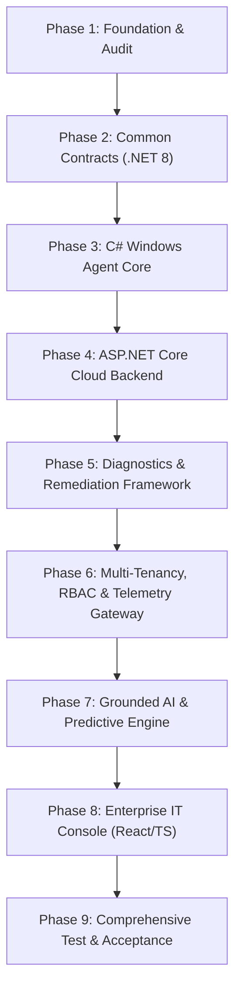

# Avantis Assist — Comprehensive Migration Plan

**Document Version:** 1.0.0  
**Migration Strategy:** Phased Zero-Downtime Evolution & Solidification  

---

## 1. Migration Strategy Overview

The migration transforms the prototype into a production-oriented enterprise architecture without blindly deleting working functionality. Every existing feature is audited, mapped, refactored, or replaced according to the following decision matrix:

| Existing Component | Current State | Migration Action | Target Production Component |
| :--- | :--- | :--- | :--- |
| **Node.js Local Agent (`agent/`)** | Node.js Express on port 9140, spawning PowerShell subprocesses | **Replace with C#** | `Avantis.Agent` (.NET 8 Windows Service with WMI / CIM & Named Pipes) |
| **FastAPI Backend (`backend/main.py`)** | SQLite backend with rule files | **Port logic to C#** | Rules and diagnostic summaries ported into ASP.NET Core Core Domain |
| **Express Backend (`backend/src/`)** | Node.js server with in-memory Postgres fallback | **Replace with C#** | `Avantis.Platform.Backend` (ASP.NET Core 8 with EF Core & PostgreSQL) |
| **5-Stage Scan Orchestrator** | Hardcoded sequential pipeline in JavaScript | **Refactor into C#** | Composable `IDiagnostic` framework with profiles (`Quick`, `Full`, `Hardware`, `Security`) |
| **Native Toast Manager (`send_toast.ps1`)** | PowerShell WinRT notification script | **Preserve & Embed** | Embedded within C# Windows Agent notification subsystem |
| **Predictive Trends Math** | Deterministic math in `predictive_monitor.js` | **Preserve & Port** | C# local trend engine + Python ML feature pipeline |
| **Gemini AI Service** | Direct REST call in Node.js | **Refactor & Secure** | Grounded Tool-Calling Gateway in Python / C# with provider abstraction |
| **Support Dashboard (`support-dashboard/`)** | Vanilla JS / CSS | **Evolve to React** | Enterprise React + TypeScript IT Console with typed API clients |
| **Client UI (`client-ui/`)** | Vanilla JS / CSS | **Modernize** | Refactored companion UI communicating with agent via secure local IPC |

---

## 2. Migration Phases & Implementation Sequence

---

## 3. Detailed Phase Breakdown

### Phase 1: Foundation & Audit (Completed)
* [x] Full repository audit and documentation of strengths and gaps (`ARCHITECTURE_AUDIT.md`).
* [x] Target Architecture and Blueprint (`ARCHITECTURE.md`).
* [x] 9 Architectural Decision Records (`docs/adr/001` through `docs/adr/009`).
* [x] Verification of .NET 8 SDK availability and installation in environment.

### Phase 2: Core Contracts & Common Libraries
* Build `Avantis.Contracts` library defining strongly-typed records and DTOs:
  * Device Registration & Identity DTOs
  * Hardware Inventory & Topology Models
  * Performance Telemetry Batches
  * Structured Event Models (with Correlation & Causation IDs)
  * Diagnostic Result & Evidence Schemas
  * Remediation Execution Contracts
  * IT Support Ticket & Knowledge Base Schemas

### Phase 3: C# Windows Agent Implementation (`agent/src/`)
* Initialize `Avantis.Agent.sln` targeting .NET 8:
  * `Avantis.Agent.Service`: Windows Service worker host (`BackgroundService`).
  * `Avantis.Agent.Hardware`: Direct WMI/CIM and Performance Counter collectors.
  * `Avantis.Agent.Storage`: Embedded SQLite store (`telemetry_queue`, `events_cache`).
  * `Avantis.Agent.Ipc`: Authenticated Named Pipe server (`\\.\pipe\AvantisAgentIpc`) and loopback HTTP compatibility bridge for development.
  * `Avantis.Agent.Notifications`: WinRT toast integration with deduplication state machine.

### Phase 4: ASP.NET Core Cloud Backend (`platform/backend/`)
* Initialize ASP.NET Core 8 Web API:
  * Configure PostgreSQL with Entity Framework Core migrations.
  * Multi-tenant query filters and tenant isolation middleware.
  * Telemetry Ingestion Controller (`POST /api/v1/telemetry`).
  * Device Registry Controller (`GET /api/v1/devices`, `GET /api/v1/devices/{id}`).
  * Alerts & Policy Engine evaluating real threshold breaches.
  * Support Ticketing API with diagnostic snapshots.
  * JWT Bearer authentication and RBAC authorization policies.

### Phase 5: Composable Diagnostics & Safe Remediation
* Implement `IDiagnostic` framework with profiles:
  * `CpuDiagnostic`, `MemoryDiagnostic`, `StorageDiagnostic`, `BatteryDiagnostic`, `GpuDiagnostic`, `NetworkDiagnostic`, `SecurityDiagnostic`, `WindowsUpdateDiagnostic`.
* Implement `IRemediation` framework with safety tiers:
  * Low: DNS flush, temp file sweep.
  * Medium: Network stack reset, Windows Update restart.
  * High: Driver update with mandatory System Restore Point.

### Phase 6: Grounded AI Assistant & Knowledge Base
* Implement tool-calling gateway isolating LLM from direct execution:
  * Tool implementations for device telemetry, health status, event inspection, and runbook search.
  * Provider abstraction supporting Google Gemini, OpenAI, and offline fallback.
  * Strict citations and evidence grounding in responses.

### Phase 7: Enterprise IT Support Console (`web/support-dashboard/`)
* Upgrade IT Support Console:
  * Real API data binding (eliminating in-memory mocks).
  * High-density tables with sorting, filtering, searching, and server-side pagination.
  * Comprehensive Device Detail investigation screen with event timeline and live sensor charts.
  * Support Ticket triage console with diagnostic evidence viewer.

### Phase 8: Verification & Acceptance Testing
* Execute complete end-to-end acceptance flow:
  1. Agent registers device $\rightarrow$
  2. Telemetry and inventory collected $\rightarrow$
  3. Spooled to SQLite and ingested into PostgreSQL $\rightarrow$
  4. Diagnostics executed with structured evidence $\rightarrow$
  5. Alerts triggered on genuine thresholds $\rightarrow$
  6. Controlled remediation executed with audit record $\rightarrow$
  7. Verification reflected in Web Console.
